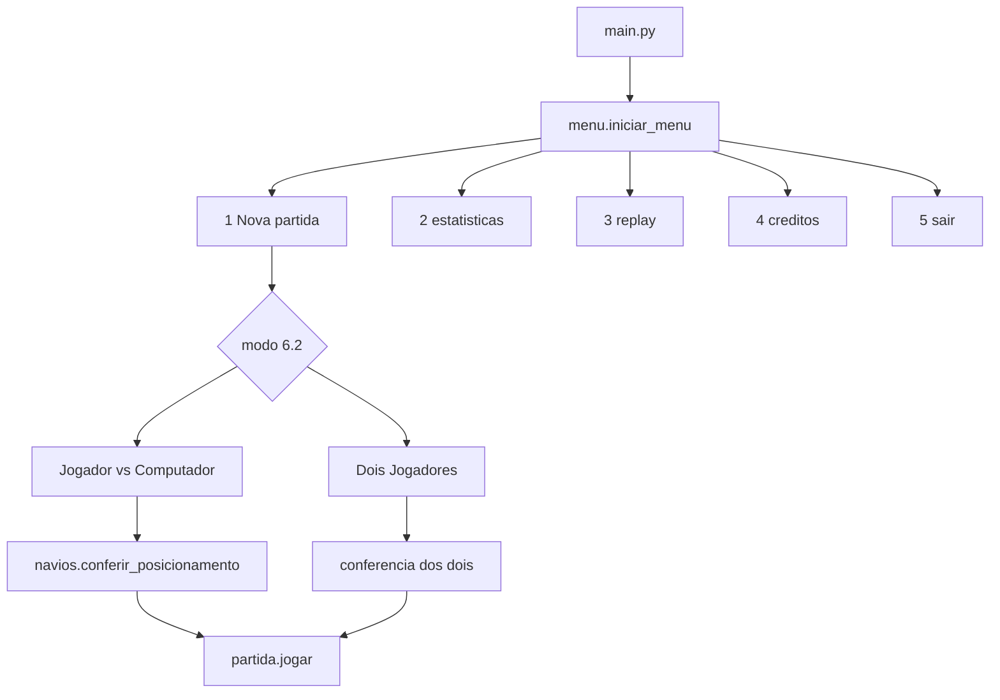

# Batalha Naval — GPTech Games

[](https://github.com/KairoHenrique/batalha-naval)
[](https://www.python.org/)
[](https://github.com/KairoHenrique/batalha-naval)
[](https://github.com/KairoHenrique)
[](https://github.com/KairoHenrique)

## Introdução

Este repositório é o **1º trabalho** da disciplina *Programação em Python* (CEFET-MG, Campus Divinópolis), professor **Guido Pantuza**. O enunciado coloca o aluno no papel de desenvolvedor júnior da GPTech Games: entregar um Batalha Naval em modo texto (GUI web é bônus), com programação estruturada, matrizes, validação de entradas e módulos coesos (PEP 8).

A **interpretação do enunciado faz parte da avaliação**. Decisões que o PDF não fecha (tamanho da frota, conferência após o auto-posicionamento, GUI em localhost em vez de Tkinter) estão documentadas abaixo e no diário.

Entrega: **29/09/2026**, pelo SIGAA, com o link deste repositório. Apresentação oral ao “Comitê de Aceite” (professor), em ordem alfabética.

## Descrição do projeto

O núcleo do jogo é Python 3.10+ (aqui, 3.12), sem dependências externas no modo texto. A lógica de cada RF fica no módulo correspondente — exigência do enunciado quando pede *função*.

Trabalho **individual**. Estado atual: Semana 4, **T8 concluído** (stats + replay). Falta a GUI web (T9/T10) e o fechamento do README (T11).

### Decisões de interpretação

| Tema | Decisão |
|------|---------|
| Frota (não especificada no PDF) | 2 navios **grandes** (4 casas) + 3 **pequenos** (2 casas) = 14 casas |
| RF04 + RF10 | Posicionamento **automático** sem overlap; o jogador **confere** e escolhe confirmar (C) ou reposicionar (R) |
| Coordenadas (RN01) | Letra + número, colunas A–J, linhas 1–10 (ex.: `C5`, `C10`) |
| GUI extra (bônus) | **Em aberto — perguntar ao professor (T11).** Menu texto fica só 1–5. Se a GUI existir, o jogo inteiro roda nela (app separado), não por opção do terminal. Enunciado cita Tkinter/Pygame; o plano cogitou FastAPI + Next.js. |
| IA extra (bônus) | Três níveis no PvC (fácil / hunt-target / parity) — Semana 3 |

### Requisitos funcionais

Identificadores do Product Owner. O README precisa referenciá-los na entrega; a coluna **Onde** aponta o módulo (ou o que ainda falta).

| RF | Descrição | Onde | Status |
|----|-----------|------|--------|
| RF01 | Menu principal | `menu.py` → `iniciar_menu()` | feito |
| RF02 | Tabuleiro 10×10 por jogador | `tabuleiro.py` | feito |
| RF03 | Navio pequeno (2) e grande (4) | `navios.py` | feito |
| RF04 | Posicionar automaticamente, sem sobreposição | `navios.py` → `gerar_frota()` | feito |
| RF05 | Validar jogadas (limites e não repetidas) | `partida.aplicar_tiro` + `utils.py` | feito |
| RF06 | Água, acerto, navio afundado | `partida.py` → `aplicar_tiro()` | feito |
| RF07 | Fim: vencedor, jogadas, tempo | `partida.exibir_fim_de_jogo` | feito |
| RF08 | Nova partida pelo menu | `menu.py` → `iniciar_nova_partida()` | feito |
| RF09 | Jogador × Computador e Dois Jogadores | `partida.jogar` (pvc/pvp) | feito |
| RF10 | Conferência dos navios antes de começar | `navios.py` → `conferir_posicionamento()` | feito |
| RF11 | Histórico de jogadas | `replay.py` + `partida.historico` | feito |
| RF12 | Estatísticas (partidas, acertos, aproveitamento) | `estatisticas.py` | feito |
| RF13 | Replay da última partida | `replay.reproduzir_ultima_partida` | feito |

Regras de negócio cobertas: **RN01–RN05**. IA extra: fácil / médio / difícil.

## Estrutura geral do projeto

A árvore do **item 5** do enunciado é o padrão da empresa. O que já existe está na raiz; o restante entra nas semanas 2–4.

```
batalha-naval/
├── README.md
├── .gitignore
├── main.py               # python main.py
├── menu.py               # RF01 / RF08 — mockups 6.1 e 6.2, créditos, GUI
├── partida.py            # loop PvC/PvP, aplicar_tiro, tela de fim
├── jogador.py            # lado humano ou CPU (frota, tiros)
├── computador.py         # T7 — IA facil / medio / dificil
├── estatisticas.py       # RF12 — partidas, acertos, aproveitamento
├── replay.py             # RF11 / RF13 — historico e replay Enter/Q
├── utils.py              # RF05 / RN01 / RN02 — parse C5, tempo HH:MM:SS
├── tabuleiro.py          # RF02 — matriz 10x10 e impressão do mockup 6.3
├── navios.py             # RF03 / RF04 / RF10 — frota, auto-place, conferência
├── data/                 # estatisticas.json e ultima_partida.json (runtime)
├── docs/
│   └── diario.md         # diário fatiado em T1–T11 (enunciado, item 10)
└── PYTHON_…BatalhaNaval.pdf   # enunciado local (não versionado)
```

Próximos arquivos extras: `api.py`, `web/` (Next.js). A árvore obrigatória do item 5 está completa.

## Implementação

Fluxo até o T6: menu → modo → conferência → loop de tiros → tela de fim.



**O que cada módulo faz, em detalhe:**

1. **`utils.py`** — constantes `A–J` / `1–10`; `parse_coordenada` aceita minúsculas e espaços; `formatar_coordenada` faz o caminho inverso; `posicao_ja_jogada` implementa RN02 (mensagem sem consumir a rodada, para o loop futuro); `formatar_tempo` gera `HH:MM:SS` (RF07); `limpar_tela` no Windows (`cls`) e no Linux (`clear`).
2. **`tabuleiro.py`** — `criar_tabuleiro()` devolve 10×10 com `~`. Símbolos do mockup: `~` água, `N` navio, `X` acerto, `O` água jogada. `imprimir_tabuleiro` alinha a linha 10 (`>2`). `ocultar_navios` troca `N` por `~` (visão do inimigo).
3. **`navios.py`** — dataclass `Navio` (tipo, tamanho, posições, acertos). Segmento sorteado **já cabe** no tabuleiro (`TAMANHO - comprimento`), horizontal ou vertical. Grandes entram primeiro. Se um navio não encaixa, a frota inteira é gerada de novo. `conferir_posicionamento(nome)` é a função do RF10: a lógica de C/R está nela.
4. **`menu.py`** — `iniciar_menu()` é o RF01. Nova partida chama `jogar`. Opção 2 estatísticas, 3 replay.
5. **`main.py`** — `python main.py` abre o menu texto. A interface web, quando existir, será um app separado (não entra neste menu).
6. **`jogador.py` / `partida.py`** — loop PvC/PvP. `aplicar_tiro` é RF05/RF06. Fim de jogo é RF07; persiste stats e replay.
7. **`computador.py`** — fácil aleatório; médio hunt-target; difícil hunt-target + parity.
8. **`estatisticas.py` / `replay.py`** — JSON em `data/`. Aproveitamento = acertos/tiros. Replay Enter/Q.

## Demonstração

```bash
python main.py         # menu (RF01) — 1 nova partida, 4 créditos, 5 sair
python tabuleiro.py    # mockup 6.3
python navios.py       # 40 frotas sem overlap + conferência C/R
```

Nova partida PvC ou PvP. Tiros `C5`. Fim com vencedor, jogadas e tempo. Menu 2 = stats; menu 3 = replay da última partida.

## Instalação e configuração

**Pré-requisitos:** Python 3.10 ou superior (desenvolvido em 3.12). Nenhuma biblioteca extra no modo texto.

```bash
# 1. Clonar o repositório
git clone https://github.com/KairoHenrique/batalha-naval.git
cd batalha-naval

# 2. Menu principal (RF01 / RF08)
python main.py

# 3. Tabuleiro e frota (inspeção)
python tabuleiro.py
python navios.py
```

No PowerShell, se o prompt estiver em `Facul`:

```powershell
cd "C:\Users\kairo\Videos\Facul\Python\Batalha Naval"
python main.py
```

### Teste rápido (checklist)

| Passo | Comando / arquivo | Resultado esperado |
|-------|-------------------|--------------------|
| Menu | `python main.py` | Mockup 6.1 com opções 1–5 |
| Nova partida | opção `1` → modo → (C/R) → tiros | Água/acerto/afundado; fim RF07 |
| Stats | opção `2` após uma partida | Tabela com partidas, vitórias, aproveitamento |
| Replay | opção `3` ou fim `[1]` | `Jogada 01/NN - nome - C5 - Agua`; Q sai |
| Diário | `docs/diario.md` | T1–T8 preenchidos; T9–T11 em branco |

## Ambiente de teste

- **Processador:** AMD Ryzen 7 5700X (8 núcleos / 16 *threads*)
- **Memória RAM:** 32 GB
- **Sistema operacional:** Microsoft Windows 11 Pro (build 26200)
- **Interpretador:** Python 3.12.10

O enunciado pede validação em **Linux** (RNF06) antes da entrega. O código de tela usa `cls` no Windows e `clear` no Linux; o restante é só stdlib.

## Recursos utilizados

`Python 3.12` · stdlib (`dataclasses`, `random`, `copy`) · `Visual Studio Code` / Cursor · GitHub

Enunciado: *PYTHON_Trabalho1_2026-02_BatalhaNaval* (Prof. Guido Pantuza). PEP 8. Diário opcional do item 10 em [`docs/diario.md`](docs/diario.md).

## Autor

Trabalho **individual** desenvolvido para a disciplina de Programação em Python.

| |
|---|
| [](https://github.com/KairoHenrique) |
| **Kairo Henrique Ferreira Martins** |
| [github.com/KairoHenrique](https://github.com/KairoHenrique) |
