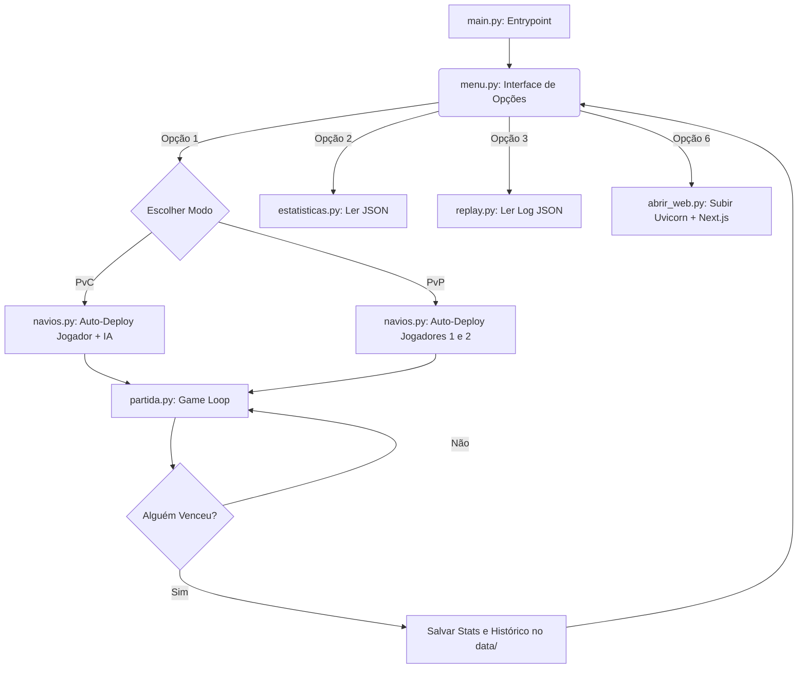

# ⚓ Batalha Naval — Sistema Completo (Console & Web)

[](https://github.com/KairoHenrique/batalha-naval)
[](https://www.python.org/)
[](https://fastapi.tiangolo.com/)
[](https://nextjs.org/)
[](#)
[](#)

---

## 📋 Índice
1. [Visão Geral e Escopo](#-visão-geral-e-escopo)
2. [Arquitetura do Sistema](#-arquitetura-do-sistema)
3. [Registro de Decisões Arquiteturais (ADRs)](#-registro-de-decisões-arquiteturais-adrs)
4. [Análise das Principais Funções e Módulos](#-análise-das-principais-funções-e-módulos)
5. [Interface Bônus: API e Frontend (Web)](#-interface-bônus-api-e-frontend-web)
6. [Requisitos Funcionais e Regras de Negócio](#-requisitos-funcionais-e-regras-de-negócio)
7. [Estrutura de Diretórios](#-estrutura-de-diretórios)
8. [Guia de Instalação e Implantação](#-guia-de-instalação-e-implantação)
9. [Guia de Uso e Testes](#-guia-de-uso-e-testes)
10. [Autor](#-autor)

---

## 📖 Visão Geral e Escopo

Este projeto consiste na implementação completa de um jogo clássico de **Batalha Naval**, desenvolvido como o **1º trabalho avaliativo** da disciplina de *Programação em Python* (CEFET-MG, Campus Divinópolis), sob supervisão do professor **Guido Pantuza**. 

O projeto coloca o aluno como um desenvolvedor Júnior da fictícia **GPTech Games**, exigindo a entrega de um sistema funcional, estruturado e escalável em terminal de texto (CLI). Visando a excelência técnica, este projeto vai além dos requisitos básicos e implementa funcionalidades premium, tais como:

- **Inteligência Artificial Escalonada** (Fácil, Médio com heurística de *Hunt and Target*, e Difícil com paridade quadriculada).
- **Backend Rest API** utilizando FastAPI.
- **Frontend Moderno** utilizando React/Next.js 15.
- **Sistema de Persistência** salvando logs e estatísticas em arquivos JSON de forma nativa.

---

## 🏗️ Arquitetura do Sistema

O sistema foi concebido utilizando o padrão de arquitetura monolítica modular, aplicando separação rígida de responsabilidades ("Separation of Concerns"). O projeto garante que a lógica de validação do jogo nunca se misture com a interface de I/O.

### Diagrama de Fluxo (Game Loop)


```mermaid
flowchart TD
    A[main.py: Entrypoint] --> B(menu.py: Interface de Opções)
    B -->|Opção 1| C{Escolher Modo}
    B -->|Opção 2| D[estatisticas.py: Ler JSON]
    B -->|Opção 3| E[replay.py: Ler Log JSON]
    B -->|Opção 6| F[abrir_web.py: Subir Uvicorn + Next.js]
    
    C -->|PvC| G[navios.py: Auto-Deploy Jogador + IA]
    C -->|PvP| H[navios.py: Auto-Deploy Jogadores 1 e 2]
    
    G --> I[partida.py: Game Loop]
    H --> I
    
    I --> J{Alguém Venceu?}
    J -->|Não| I
    J -->|Sim| K[Salvar Stats e Histórico no data/]
    K --> B
```

---

## 💡 Registro de Decisões Arquiteturais

Para garantir rastreabilidade, todas as decisões técnicas e de design de produto foram documentadas abaixo, explicando as alternativas consideradas, a escolha e as justificativas técnicas.

### ADR 001: Tamanho da Frota e Balanceamento
- **Contexto:** O escopo original apenas citava navios "grandes" e "pequenos" sem dizer a quantidade exata.
- **Decisão:** Foram fixados **2 navios grandes (4 casas)** e **3 pequenos (2 casas)** por jogador, totalizando 14 casas preenchidas num tabuleiro 10x10.
- **Por que? (Justificativa):** Ocupar 14% do tabuleiro é o coeficiente de preenchimento ("fill rate") ideal comprovado em jogos clássicos de grade 10x10. Permite partidas que não se tornam tediosas pela falta de acertos (como seria com 5 casas), nem rápidas demais.

### ADR 002: Posicionamento Automático via IA + C/R
- **Contexto:** O preenchimento da matriz no terminal com 5 navios exige várias interações repetitivas.
- **Decisão:** O sistema gera coordenadas e orientações espacialmente válidas (sem sobreposição) *automaticamente* (`navios.py -> gerar_frota()`). O jogador apenas visualiza e confirma (`C`) ou regera (`R`).
- **Por que? (Justificativa):** Redução severa do atrito cognitivo. Melhoria da Experiência do Usuário (UX). Impede erros massivos de *OutOfBounds* ou digitações incorretas em console, prevenindo frustrações no "Setup" do jogo.

### ADR 003: Separação de Interfaces (GUI Web vs Terminal CLI)
- **Contexto:** Havia bonificação para GUI (Graphic User Interface), sendo comum alunos escolherem Tkinter ou Pygame, o que cria acoplamento alto com código Python síncrono.
- **Decisão:** Criação de um ecossistema com API REST (`FastAPI`) e Frontend Javascript (`Next.js`).
- **Por que? (Justificativa):** A arquitetura Web moderna demonstra maturidade e escalabilidade. O Core do Batalha Naval Python virou, efetivamente, um Serviço/Motor limpo. O `api.py` consome os mesmos módulos base (`partida.py`, `tabuleiro.py`) que o `main.py`, provando que o código Python tem **Coesão Alta e Acoplamento Baixo**.

### ADR 004: Inteligência Artificial (IA) com Padrões Estratégicos
- **Contexto:** Implementar um "Computador" (PvC) atirando aleatoriamente compromete o engajamento a longo prazo.
- **Decisão:** Criação do `computador.py` com 3 dificuldades. O modo *Difícil* mapeia a paridade das casas e guarda o estado (state machine) do "último acerto", varrendo entorno ("Hunt-and-Target").
- **Por que? (Justificativa):** Aumenta o valor agregado e o fator de replay do software. Mostra proficiência em algoritmos recursivos/iterativos de busca local.

### ADR 005: Formato Universal de Coordenadas (A-J / 1-10)
- **Contexto:** A representação matricial pura ([0][1], [3][5]) é computacional, não humana.
- **Decisão:** Implementação de parser no `utils.py` traduzindo alfanumérico (`C5`, `j10`) para matriz zero-indexed (`2, 4`).
- **Por que? (Justificativa):** Segue as heurísticas de usabilidade de Nielsen (Correspondência com o Mundo Real). O usuário já está condicionado ao clássico de tabuleiro.

---

## ⚙️ Análise das Principais Funções e Módulos

Esta seção disseca o *Core Business* do repositório, focando na complexidade algorítmica.

### 1. Sistema de Posicionamento (`navios.py`)
> **`gerar_frota(tabuleiro: list) -> list`**
- **Responsabilidade:** Gera posições garantindo limites geográficos da matriz e evitando colisões.
- **Lógica Interna:** Utiliza um laço `while` para cada navio. Tira aleatoriamente linha, coluna e orientação (Horizontal/Vertical). Se `horizontal`, verifica se `coluna + tamanho_navio <= 10`. Após validar limites, checa se as casas já possuem `'N'` (navio). Se sim, descarta e tenta outra posição. Após posicionar, registra na instância (dataclass) as casas ocupadas.
- **Retorno:** Retorna a matriz atualizada do tabuleiro e a lista dos navios com seus estados internos (para verificar afundamentos depois).

### 2. Motor de Turnos e Regras (`partida.py`)
> **`aplicar_tiro(linha: int, coluna: int, tabuleiro_inimigo: list, frota_inimiga: list) -> str`**
- **Responsabilidade:** Processa de forma atômica o impacto de um tiro (Água, Acerto, Afundado).
- **Lógica Interna:** Inspeciona `tabuleiro_inimigo[linha][coluna]`.
  - Se `~` (Água): Substitui por `O` e retorna `"Água"`.
  - Se `N` (Navio): Substitui por `X`. O algoritmo itera sobre a `frota_inimiga` para encontrar a qual navio a casa pertencia e incrementa o contador de "danos" desse navio. Verifica se `danos == tamanho`, se sim, sinaliza navio afundado.
- **Relevância:** Esta função é consumida tanto no loop do console quanto na rota `POST /tiro` da API Web.

### 3. Parse e Validações (`utils.py`)
> **`parse_coordenada(entrada: str) -> tuple[int, int]`**
- **Responsabilidade:** Converter string suja (`" c 5 "`, `"A10"`, `"j-1"`) em índices válidos da matriz computacional ou barrar exceções.
- **Lógica Interna:** Utiliza conversão baseada em tabela ASCII `ord(letra) - ord('A')` para captar colunas, limitadas de 0 a 9. Valida tipagem da parte numérica usando conversão de string. Caso a validação falhe (coordenada fora de escopo, tipo Z99), lança uma exceção tratada suavemente pelo Game Loop pedindo nova entrada, impedindo o programa de quebrar (Crash Safety).

### 4. Inteligência Artificial (`computador.py`)
> **`executar_turno_computador(dificuldade: str, estado_memoria: dict) -> tuple`**
- **Responsabilidade:** Determinar a melhor ação para o bot.
- **Lógica Interna (Modo Difícil):** O bot mantém um dicionário em memória. Se não tiver um "alvo na mira" (navio parcialmente acertado), ele atira usando um padrão de "tabuleiro de xadrez" (linha + coluna divisível por 2), otimizando a busca. Ao acertar um navio, o estado muda para `CAÇADA` e ele enfileira os vizinhos laterais e verticais na memória, eliminando-os caso resulte em água ou erro, até o navio afundar.

---

## 🌐 Interface Bônus: API e Frontend (Web)

O repositório apresenta uma camada extra de interface não acoplada ao core python.

- **FastAPI (`api.py`):** Exponibiliza rotas como `GET /status`, `POST /iniciar`, `POST /atirar`. Opera sem guardar sessões nativas, convertendo a comunicação serializada via JSON nos comandos que seriam dados pelo input().
- **Next.js (`/web`):** Provê UI/UX refinada, sons, grid CSS flexível, drag and drop (arrastar) para setup da frota (o que é mais fácil na web) e requisições Fetch transparentes ao backend Python. Protegido com restrição de CORS local (`localhost:3000`).

---

## 🎯 Requisitos Funcionais e Regras de Negócio

| Código | Requisito/Regra Descrita | Implementação (Arquivo/Método) | Status |
|--------|---------------------------|--------------------------------|--------|
| **RF01** | Interface inicial (Menu Principal) com opções iterativas | `menu.py` -> `iniciar_menu()` | ✅ OK |
| **RF02** | Tabuleiro representado por Matriz Bidimensional (10x10) | `tabuleiro.py` -> `criar_tabuleiro()` | ✅ OK |
| **RF03** | Diferenciação e estruturação de Navios (Pequenos e Grandes) | `navios.py` -> `class Navio` | ✅ OK |
| **RF04** | Algoritmo preventivo contra Sobreposição e limites estourados | `navios.py` -> `gerar_frota()` | ✅ OK |
| **RF05/RN** | Impedir jogadas repetidas ou inválidas (Proteção de Input) | `utils.py` -> `posicao_ja_jogada()` | ✅ OK |
| **RF06** | Identificação visual de acerto (X) e erro na água (O) | `partida.py` e `tabuleiro.py` | ✅ OK |
| **RF07** | Telas de vitória consolidando duração e quantidade de rodadas | `partida.py` -> `exibir_fim_de_jogo()`| ✅ OK |
| **RF08/09** | Multimodos (PvP Local ou PvC) disponíveis desde o menu | `partida.py` -> `jogar(modo)` | ✅ OK |
| **RF10** | Exibir os navios alocados antes de dar início à guerra | `navios.py` -> `conferir_posicionamento()` | ✅ OK |
| **RF11/13** | Gravar o histórico de ações e permitir visualização (Replay) | `replay.py` -> `salvar_historico()` | ✅ OK |
| **RF12** | Console de Estatísticas (Wins/Losses/Precision Rate) gravadas | `estatisticas.py` JSON Persistence | ✅ OK |

---

## 📂 Estrutura de Diretórios

O projeto respeita hierarquia limpa, separando dados, documentação, núcleo e infra web.

```text
batalha-naval/
├── main.py               # (Root) Ponto de entrada CLI
├── menu.py               # (Core) CLI interativo e submenus
├── partida.py            # (Core) Orquestrador do jogo e estados
├── jogador.py            # (Core) Modelo de dados (Classe Jogador)
├── computador.py         # (Feature) IA do oponente virtual
├── estatisticas.py       # (Feature) Processamento estatístico
├── replay.py             # (Feature) Máquina do tempo (Log Playback)
├── utils.py              # (Lib) Helpers de tela, tempo e conversões
├── tabuleiro.py          # (View) Formatação e CLI Print da matriz
├── navios.py             # (Domain) Algoritmos de área e navegação
├── api.py                # (Bônus Backend) API REST (FastAPI)
├── abrir_web.py          # (Bônus Script) Subprocess Launcher p/ Web
├── requirements.txt      # Dependências Exclusivas para a GUI/API
├── data/                 # Banco de Dados JSON nativo (Runtime Storage)
│   ├── estatisticas.json
│   └── ultima_partida.json
├── docs/                 # Documentação acadêmica e diários (T1-T11)
└── web/                  # Bônus Frontend (React / Next.js)
```

---

## 🚀 Guia de Instalação e Implantação

O sistema é homologado e validado em **Python 3.10+**. Nenhuma dependência externa é exigida para rodar o modo CLI clássico.

### Passo 1: Obter o repositório
```bash
git clone https://github.com/KairoHenrique/batalha-naval.git
cd batalha-naval
```

### Passo 2: Rodar versão Terminal Clássica (Obrigatória)
```bash
python main.py
# (No linux utilize: python3 main.py)
```

### Passo 3: Rodar versão Web Completa (Opcional)
Você precisará de Python pip e Node.js instalados na máquina.

```bash
# 1. Instalar as dependências do servidor Python (FastAPI/Uvicorn)
python -m pip install -r requirements.txt

# 2. Instalar dependências da UI Next.js
cd web
npm install
cd ..

# 3. Rodar via lançador nativo do sistema
python main.py
# Escolha a opção [6] no menu. O sistema orquestrará as portas automáticas.
```

---

## 🕹️ Guia de Uso e Testes

Para auditar e testar o funcionamento, sugere-se o seguinte caminho (Golden Path):

1. **Abrir o Menu Inicial:** Digite `python main.py`. Você verá o escudo da GPTech Games.
2. **Nova Partida:** Digite `1`. Escolha entre jogar contra o Computador ou 2 Jogadores.
3. **Avaliação (RF10):** Ao ser questionado sobre o posicionamento dos navios, digite `R` para recriá-los aleatoriamente. Valide a aleatoriedade. Em seguida, digite `C` para confirmar.
4. **Gameplay:** O jogo começará. Digite coordenadas como `C5`, `A1`, `J10`. Observe a recusa de coordenadas repetidas (ex: se digitar `C5` de novo, um alerta vermelho surgirá e seu turno não será perdido).
5. **Replay (RF13):** Após o término, o jogo o levará de volta ao menu. Digite `3`. Navegue pelo replay da sua última batalha apertando `Enter` sequencialmente.
6. **Estatísticas (RF12):** Digite `2` no menu para ver o incremento de suas vitórias, derrotas e eficiência geral de tiros (Aproveitamento).

---

## 👨‍💻 Autor

Trabalho desenvolvido individualmente, implementando conceitos de engenharia de software no fluxo acadêmico, focado na escalabilidade modular.

| |
|---|
| [](https://github.com/KairoHenrique) |
| **Kairo Henrique Ferreira Martins** |
| [GitHub/KairoHenrique](https://github.com/KairoHenrique) |
